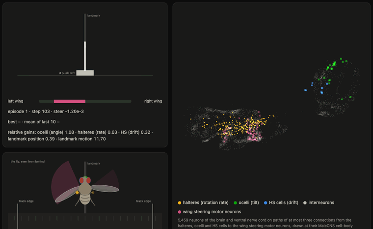

# fly-cartpole

<p align="center">
  
</p>

[English](README.md) · **한국어**

## 배경 및 목표

초파리의 뇌를 그대로 가져다 쓰면 CartPole을 풀 수 있을까? 이를 확인하기 위해 성체 수컷 초파리
커넥톰인 [MaleCNS v1.0](https://male-cns.janelia.org/)에서
신경 회로를 떼어 와 Gymnasium의 CartPole-v1에 연결했다.

가장 크게 염두했던 원칙은 **역전파(backpropagation)로 학습하는 인공 신경망 없이, 초파리의 신경세포만으로
막대기를 세우는 것**이었다. 막대기를 세우는 계산은 전부 커넥톰의 연결대로 이어진 초파리 신경세포들이
맡고, 학습하는 동안에도 이 연결은 하나도 바뀌지 않는다. 학습으로 바뀌는 것은 감각별 계수(gain, 각 감각
신호를 회로에 얼마나 크게 넣을지) 5개뿐이다. 에피소드마다 계수를 무작위로 살짝 바꿔 보고, 그
에피소드가 최근 기록보다 나았는지를 도파민 신호로 받는다. 도파민이 양수면 시도한 방향으로, 음수면 반대
방향으로, 그 크기만큼 계수를 조정하는 식이다. 도파민 신호는 회로 밖에서 따로 계산했으며, 이런 학습
방식이 실제 초파리에 있는지는 아직 확인되지 않았다.

최종적으로 사용한 회로는 초파리가 날면서 균형을 잡을 때 쓰는 **비행 안정화 회로**다. 초파리의 비행
능력을 카트폴에 대응시킨 것으로, 반사만으로 막대기를 세우고 랜드마크를 보면서 제자리를 지킨다.
[웹뷰어](https://curt-park.github.io/fly-cartpole/)에서는 회로에 있는 신경세포 5,459개를 모두 브라우저에서 실시간으로 시뮬레이션하며, 이
초파리가 움직이는 모습을 직접 볼 수 있다.

[](https://curt-park.github.io/fly-cartpole/)

## 결과

평가는 이전에 한 번도 쓰지 않은 시드 20개로, 조건마다 한 번씩만 진행했다. CartPole-v1의 에피소드는
최대 500스텝이다.

| 초파리 | 학습 대상 | 시드 | 최근 100 에피소드 평균 |
|---|---|---|---|
| 튜닝 전 | 없음 | 160-179 | 275.6 ± 9.4 |
| 자가튜닝 | 감각 계수 3개 | 160-179 | 499.9 ± 0.3 |
| **랜드마크 + 커리큘럼 러닝** | 감각 계수 5개 | 240-259 | **500.0 ± 0.0** |
| 무작위로 밀기 (기준선) | – | 160-179 | 22.1 ± 0.8 |

개인적으로 가장 재밌었던 점은 커넥톰에서 가져온 회로를 아무 튜닝 없이 그대로 써도 평균 275.6스텝을
버틴다는 것이다. 막대기를 떨어뜨린 적은 한 번도 없었고, 500스텝을 채우지 못한 에피소드는 모두
카트가 트랙을 벗어나서 끝났다. 초파리가 날면서 균형을 잡는 회로가 별다른 조정 없이도 막대기의 균형을 잡은 셈이다.

자가튜닝을 거치면 500스텝 안에서는 대부분 만점이 나오기 때문에 차이를 보기 어려웠다. 그래서
랜드마크를 쓰는 초파리는 에피소드를 2,000스텝까지 늘려 따로 비교했는데, 시드마다 10번씩 튜닝이
끝난 계수로 탐색 없이 돌렸다. 비교 대상은 막대기를 오래 세우는 것만으로 튜닝한 랜드마크
초파리다.

| 초파리 | 트랙 이탈 | 막대기 쓰러짐 | 중심에서의 평균 거리 |
|---|---|---|---|
| 오래 세우는 것만으로 튜닝 | 200번 중 10번 | 0번 | 0.48 m |
| **커리큘럼 러닝** | **200번 중 0번** | **0번** | **0.12 m** |

자세한 수치와 순열 검정 결과는 [반사 초파리](results/reflex/summary.md),
[랜드마크 + 커리큘럼 러닝](results/staged/summary.md)에 정리되어 있다.

## 최종적으로 효과가 있었던 아이디어와 메커니즘

- **비행 회로 활용.** 초파리 뇌가 원래 잘하는 일을 기반으로 했다. 막대기의 기울기는 홑눈(ocelli)이
  몸이 기운 것처럼 읽고, 막대기가 넘어가는 속도는 평균곤(haltere)이, 카트의 속도는 HS 세포가 시야의
  흐름(optic flow)으로 읽는다. 카트를 어느 쪽으로 밀지는 좌우 날개 조향 운동뉴런(b1, b2)의 활동
  차이로 정하는데, 날갯짓이 센 쪽으로 미는 셈이다.
- **자가튜닝(self-tuning).** 초파리가 감각 계수를 스스로 파인튜닝한다. 에피소드마다 계수를 조금씩
  바꿔 보고, 최근 기록보다 오래 버티면 그쪽으로 옮겨 간다. 실제로 중요한 것은 계수 간의 비율인데,
  튜닝 전에는 평균곤 신호가 홑눈보다 48배쯤 강하던 것이 튜닝을 거치면 5배쯤으로 줄어든다.
- **랜드마크 - 위치.** 제자리날기에서 힌트를 얻었다. 파리는 옆으로 이동할 때 가려는 쪽으로 몸을 먼저
  기울이기 때문에, 카트가 가운데보다 오른쪽에 있으면 막대기가 오른쪽으로 기운 것처럼 느끼게 했다.
- **랜드마크 - 움직임.** 랜드마크가 시야에서 얼마나 빨리 움직이는지도 함께 반영했다. 가운데로
  돌아오는 동안 포지션이 흔들리는 것을 잡아 준다.
- **커리큘럼 러닝(Curriculum Learning).** 처음에는 막대기를 오래 세우는 것에 보상을 주고, 세우는 것을
  잘하게 된 뒤에는 포지션을 잘 유지하는 것에 보상을 준다. 두 번째 단계에서는 균형을 잡는 계수를
  고정해서, 포지션을 맞추는 과정에서 균형이 무너지지 않도록 했다.

## 실험 일지

실패한 시도까지 포함한 모든 가설과 시드 운용 규칙, 단계별 분석은 [EXPERIMENTS.ko.md](EXPERIMENTS.ko.md)에
정리했다. 비행 회로로 넘어오기 전에 초파리의 학습 중추인 버섯체(mushroom body)로 먼저 시도했던
실험도 여기에 들어 있는데, 버섯체는 도파민으로 시냅스를 바꿔 가며 학습해서 평균 392.5스텝까지
도달했었다.

## 실행 방법

```bash
uv sync
python3 -m http.server -d web        # 웹뷰어: http://localhost:8000
uv run fly-cartpole reflex-tune      # 튜닝용 시드 100-109로 자가튜닝 학습률 선택
uv run fly-cartpole station-compare --seeds 240-259 \
  --conditions fly-reflex-station-staged-motion,fly-reflex-station --results results/staged
uv run fly-cartpole export-flight    # 시드 0으로 웹뷰어용 초파리를 튜닝해서 web/data/flight.json 생성
uv run pytest
```

추출해 둔 회로 데이터는 저장소에 포함되어 있다. MaleCNS에서 회로를 다시 추출하려면
`uv run fly-cartpole extract-flight`를 실행하면 된다(처음 한 번 약 1.1 GB를 내려받는다). CPU 12코어
기준으로 `reflex-tune`은 1시간 30분, `station-compare`는 1시간 정도 걸린다.

## AI Assistant와의 협업 방식

Claude Code(모델은 Claude Opus 5.5, effort는 high)와의 큰 틀에서의 협업 방식은 다음과 같다.

- **방향 설정은 내가 했다.** 큰 전환점은 대부분 내 질문이나 아이디어에서 시작되었다. 비행 회로로의
  전환, 자가튜닝, 제자리날기에서 힌트 얻기, 커리큘럼 러닝이 그랬다.
- **구현과 검증은 Claude Code가 맡았다.** 아이디어를 실제로 동작하는 메커니즘으로 구현하고, 튜닝용
  시드로 먼저 가볍게 돌려 본 뒤, 실패한 결과까지 수치로 보고했다. 다음 단계는 그 수치를 보고 내가
  결정했다.

내가 던진 질문이나 아이디어를 Claude Code가 빠르게 구현하고 실험해 주었기 때문에, 짧은 시간 안에 많은
가설을 검증할 수 있었다.

초반 실험에서는 Claude Code가 밤새 스스로 개선해 나가도록 맡겨 보기도 했는데, 성능을 일정 수준 이상으로
끌어올리지 못했다. AI에게 전부 맡겨 두기보다는 사람도 능동적으로 아이디어를 던지고 방향을 제안하는 것이 중요한 것
같다.

## 출처

- MaleCNS v1.0 커넥톰 (CC BY 4.0). [NOTICE.md](NOTICE.md) 참고.
- 비행 관련: Fayyazuddin and Dickinson 1996, *Journal of Neuroscience* (평균곤에서 b1 조향
  운동뉴런으로 가는 입력); Dickinson 1999, *Philosophical Transactions of the Royal Society B*
  (평균곤의 평형 반사); Chan, Prete and Dickinson 1998, *Science* (평균곤 조향 근육으로 가는 시각
  입력); Reichardt and Poggio 1976, *Quarterly Reviews of Biophysics* (파리의 방향 제어에서 위치와
  움직임).
- Barto, Sutton and Anderson 1983 (카트폴 과제).
