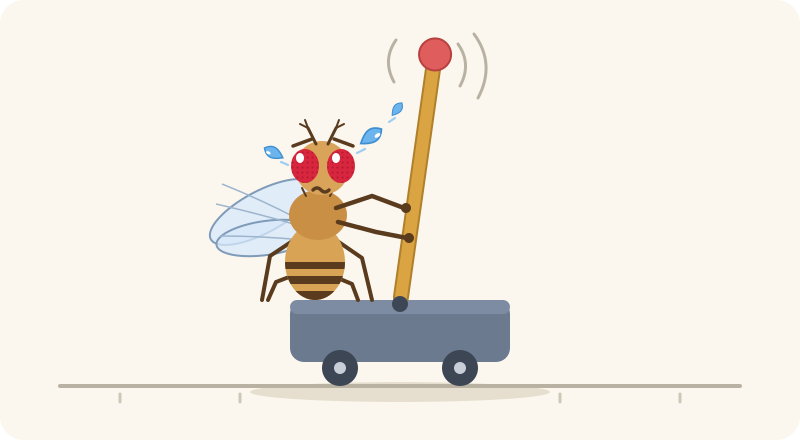

<p align="center">
  
</p>

# fly-cartpole

[English](README.md) · **한국어**

[MaleCNS v1.0](https://male-cns.janelia.org/) 커넥톰에서 시냅스 단위로 그대로 옮겨 온 초파리의
버섯체(mushroom body) 두 개가, 도파민이 조절하는 가소성만으로 Gymnasium의 CartPole을
학습합니다. 웹 뷰어는 학습을 마친 초파리를 브라우저에서 실시간으로 돌리면서, 막대기를 세우는
동안 버섯체의 어떤 뉴런이 활성화되는지 보여 줍니다.

## 결과

**초파리는 막대기 세우기를 학습했고, "해결" 기준을 넘었습니다.** 타고난 배선 그대로라면 초파리는
21걸음쯤 만에 막대기를 떨어뜨립니다(`fly-bilateral-frozen`). 2,000 에피소드를 학습하고 나면, 이전
실험이 한 번도 건드리지 않은 평가 시드 20개에서 마지막 100 에피소드 동안 평균 **233.8걸음**을
버팁니다. CartPole-v0은 연속 100 에피소드 평균 195를 "해결"로 봅니다. 스무 마리 중 열다섯 마리가
각자 이 기준을 넘었고, 모든 개체가 학습했으며(161-304걸음), 마지막 에피소드 중 6%는 500걸음 상한에
도달했습니다. 같은 케년 세포(Kenyon cell)를 읽는 교과서적 TD actor-critic은 평균이 더 높지만(302),
편차가 훨씬 커서 시드 두 개에서는 아예 실패했습니다.


| 조건 | 설명 | 마지막 100 에피소드 평균 ± 표준편차 (시드 20개) | 500걸음에 도달한 에피소드 |
|---|---|---|---|
| `fly-bilateral` | 버섯체 두 개, 예측 오차 도파민, push-pull 가소성 | **233.8 ± 43.1** | 6% |
| `fly-bilateral-shuffled` | 위와 같되 PN→KC와 KC→MBON 배선을 연결 수를 보존하며 섞음 | 218.3 ± 66.3 | 7% |
| `fly-bilateral-frozen` | 위와 같되 가소성 없음 | 21.3 ± 13.9 | 0% |
| `fly` | 첫 설계: 버섯체 하나, 행동을 냄새처럼 맡음 | 22.2 ± 13.6 | 0% |
| `td` | 같은 케년 세포 코드 위의 TD actor-critic (초파리 아님) | 302.3 ± 168.0 | 38% |
| `random` | 무작위로 밀기 (우연 수준) | 22.2 ± 1.0 | 0% |

시드별 마지막 100 에피소드 평균으로 순열 검정을 수행했습니다(모든 조건과 검정은
[results/summary.md](results/summary.md)에 있습니다).

- 초파리가 학습합니다: `fly-bilateral` > `fly-bilateral-frozen`, p = 0.0001
- 우연 수준을 넘어섭니다: `fly-bilateral` > `random`, p = 0.0001
- 실측 배선이 도움이 된다는 뚜렷한 증거는 없습니다: `fly-bilateral` > `fly-bilateral-shuffled`,
  p = 0.20. 섞기는 세포 수, 각 세포의 연결 상대 수, 각 도파민 뉴런이 닿는 위치를 그대로 두고,
  어느 케년 세포가 어느 세포와 연결되는지만 바꿉니다. 따라서 학습의 대부분은 정확한 시냅스
  지도가 아니라 이 구조에서 나옵니다. 이전 평가들의 결과는 엇갈렸습니다(시드 0-9에서는 실측
  배선이 앞섰고(p = 0.037), 시드 30-49에서는 섞은 배선이 앞섰습니다).

하이퍼파라미터는 튜닝 시드 100-139에서만 탐색했고, 평가 시드 50-69에는 그대로 적용했습니다
([results/tuning.json](results/tuning.json)).

## 여기까지 온 과정

첫 설계는 [fly-blackjack](https://github.com/WilliamJones/fly-blackjack)을 충실히 따랐지만
우연 수준에 머물렀습니다. 아래 표의 각 행은 가설 하나이며, 평가 시드를 건드리기 전에 튜닝
시드(100번 이상)에서 먼저 검증했습니다. 점수는 마지막 100 에피소드의 평균 길이이며, 따로 적지
않았다면 튜닝 시드 다섯 개의 평균입니다.

| # | 가설 | 바꾼 것 | 튜닝 시드 | 판정 |
|---|---|---|---|---|
| 0 | fly-blackjack 방식이 그대로 통한다 | 버섯체 하나; "상태 + 왼쪽 밀기"와 "상태 + 오른쪽 밀기"를 냄새처럼 맡고 나은 쪽을 고름(T-maze); 도파민은 시냅스를 약화하기만 함; 막대기가 넘어지면 처벌, 최근 평균을 넘는 동안 보상 | 27 | 우연 수준 |
| 1 | 도파민은 예측 오차여야 한다 | 초파리 자신의 MBON 가치로 계산한 TD 오차를 도파민으로 사용 (Bennett et al. 2021) | 29 | 기각 |
| – | *진단: 인코딩이 문제인가?* | 같은 상태 + 행동 케년 세포 코드 위에서 제약 없는 선형 SARSA 실행 | 34-55 | 그렇다: 행동을 냄새로 넣는 코드가 상태를 가린다 |
| 2 | 미는 방향마다 버섯체를 하나씩 둔다 | 왼쪽 버섯체는 왼쪽 밀기의 가치를, 오른쪽 버섯체는 오른쪽 밀기의 가치를 매김; 둘 다 상태만 봄 | 최대 67 | 첫 신호, 불안정 |
| 3 | 타고난 좌우 편향이 학습을 막는다 | 양쪽을 타고난 평균 가치에 맞춰 중심화 | 61 | 기각 |
| 4 | 학습 전의 초파리는 무관심하다 | 가치 = 학습으로 바뀐 부분만 | 63 | 기각 |
| 5 | 선택되지 않은 쪽은 반대 교훈을 배워야 한다 | 두 쪽 사이의 대립 교습 | 39 | 기각 |
| 6 | 목표값이 제한된 시냅스로 표현할 수 있는 범위를 넘는다 | 넘어질 때만 처벌하고 크기를 줄임 | 49 | 기각 |
| – | *진단: 시냅스 규칙이 문제인가?* | 상태만 담은 두 코드 위에서 제약 없는 선형 SARSA 실행 | 275 | 그렇다: 범위가 제한되고 약화만 되는 시냅스 |
| 7 | MBON 출력이 선택에 너무 약하게 반영된다 | MBON에서 선택으로 가는 출력을 증폭 | 62 | 기각 |
| 8a | 도파민 간섭이 학습을 상쇄한다 | 처벌은 접근 MBON에만, 보상은 회피 MBON에만 | 49 | 기각 |
| **8b** | **약화만 하는 가소성은 시냅스를 고갈시킨다** | **Push-pull: 흔적이 남은 시냅스는 방출된 도파민이 닿는 곳에서 약해지고, 반대 도파민이 닿는 곳에서 회복됨** | **237** | **학습함** (평가 시드 0-9: 194) |
| 9 | 상태 사이의 일반화를 높인다 | 사구체 조율 폭을 넓히고 활성 케년 세포를 늘림 | 234 | 개선 없음 |
| 10 | 보상 설계가 어긋나 있다 | 기록 보상 축소, 할인율 단축, 또는 넘어질 때만 처벌 | 최고 235; 처벌만 91-187 | 개선 없음 |
| 11 | push-pull에서도 타고난 편향이 해가 된다 | 양쪽을 다시 중심화 | 174 | 기각 |
| 12 | 연습이 더 필요할 뿐이다 | 2,000 에피소드 | 500, 1,000, 1,500, 2,000에서 147, 237, 167, 182 | 아니다: 성능이 표류함 |
| 13 | 수면이 기억을 공고화한다 | 에피소드가 끝날 때마다 한 번 더 재생 | 176 | 기각 |
| 14 | 가소성은 경험이 쌓일수록 잦아들어야 한다 | 학습률을 lr / (1 + episode / τ)로 감소 | 178 | 기각 |
| – | *진단: 시냅스가 포화되는가?* | 학습 중 이득과 가치를 추적 | 경계에 붙은 이득은 2-7%; 한쪽 버섯체가 표현할 수 있는 가치는 약 −0.6에서 +0.7이지만, 목표값은 −1(넘어짐)에서 +10(기록을 길게 넘는 경우)까지 | 시냅스가 아니라 목표값이 범위를 벗어난다 |
| 15 | 결과의 크기를 가치 범위에 맞춰야 한다 | 처벌과 기록 보상을 0.1배로 줄이고 학습률을 키움 | 275 | 좋아 보였지만 평가 시드 0-9에서는 115: 열 마리 중 세 마리가 전혀 학습하지 못함 |
| – | *진단: 왜 어떤 초파리는 전혀 학습하지 못하는가?* | 고착된 초파리에서 양쪽 가치를 추적 | 한쪽 가치가 줄어든 처벌(−0.1)보다 아래로 가라앉음. 반대쪽 가치는 그 아래로 내려갈 수 없으므로 매번 선택되고, 가라앉은 쪽은 다시는 시도되지 않음 | 고착; 새 튜닝 시드 40개 중 결과 크기 0.1에서 8개, 0.3에서 1개, 1.0에서 2개가 고착됨 |
| 16 | 기록 보상의 기준선이 움직여서 붕괴가 일어난다 | 기준선을 더 느리게(50 또는 100 에피소드), 또는 버틴 걸음마다 고정 보상 | 최고 215 | 기각: 최근 20 에피소드 기록 보상이 가장 좋다 |
| 17 | 선택을 부드럽게 하면 가라앉은 쪽이 다시 기회를 얻는다 | 결과 크기 0.1에서 β를 100 대신 30으로 | 44 (시드 40개, 300 에피소드), 6개 고착 | 기각 |
| **18** | **튜닝 시드 다섯 개로는 다섯 번에 한 번 일어나는 실패를 볼 수 없다** | **기록 보상을 0.1로 고정하고, 시드 40개(100-139)에서 결과 크기 0.1, 0.3, 1.0을 두고 튜닝** | **221 (시드 40개), 고착된 시드 없음** | **채택: 결과 크기 0.3; 1,000 에피소드 후 새 평가 시드 30-49에서 191.7** |
| **19** | **결과 크기가 범위 안에 들어오면 연습을 더 할수록 계속 나아진다** | **1,000 대신 2,000 에피소드** | **500, 1,000, 1,250, 1,500, 2,000에서 194, 221, 231, 227, 232 (시드 40개)** | **채택: 1,250 에피소드 이후 완만해지지만 무너지지 않음; 새 평가 시드 50-69에서 233.8** |

**평가 시드는 네 번 소모되었으며, 모든 소모 내역을 여기에 밝힙니다.** 시드 0-9로는 push-pull
초파리를 결과 크기 1.0에서(194), 이어서 0.1에서(115, 고착) 평가했습니다. 시드 10-29로는 원래
설계의 탐색이 다른 모든 조건의 기록 보상 크기까지 정해 버린 실행을 평가했습니다(0.1 대신 0.5;
양쪽 버섯체 초파리 162.5). 보상은 과제의 일부이므로 이제는 고정하고 탐색하지 않습니다. 시드
30-49로는 시드 40개로 튜닝한 초파리를 1,000 에피소드 후에 평가했습니다(191.7, 3걸음 부족).
그다음 가설 19는 튜닝 시드에서만 검증했고, 맨 위의 수치는 이전 실험이 한 번도 건드리지 않은
시드 50-69에서 나왔습니다.

결과를 만든 발견은 세 가지입니다. 첫째, 초파리가 각 행동을 냄새처럼 맡고 비교하는
fly-blackjack의 선택 방식은 막대기의 상태를 행동 코드 밑에 묻어 버립니다. 미는 방향마다
버섯체를 따로 두자 이 문제가 해결되었습니다. 둘째, 도파민이 약화만 시킬 수 있는 시냅스는
결국 고갈됩니다. 실수할 때마다 약화로 처벌받으므로 쓸모 있는 시냅스까지 0으로 가라앉고
다시는 돌아오지 않습니다. 반대편 도파민 집단이 흔적이 남은 시냅스를 회복시키도록
허용하자(push-pull), 제자리에 멈춰 있던 초파리가 수백 걸음 동안 막대기를 세우게 되었습니다.
셋째, 버섯체 하나가 제한된 시냅스로 표현할 수 있는 가치는 약 −0.6에서 +0.7 사이에 불과한데,
넘어짐의 가치는 −1이고 기록을 길게 넘는 경우의 가치는 +10까지 올라갑니다. 결과의 크기를 이
범위 쪽으로 줄이자(원래의 0.3배) 학습이 더 빨라지고 시드 사이의 편차도 줄었습니다. 다만 너무
많이 줄이면(0.1배) 한쪽 가치가 처벌보다 아래로 가라앉아, 초파리가 한쪽으로만 미는 상태에
고착되었습니다.

보상 설계는 사람에게 빗댄 아이디어에서 나왔습니다. 막대기가 넘어지면 처벌하고, 초파리가
최근 기록을 넘어서는 순간부터 매 걸음 보상을 줍니다. 최고 기록이 5초인 사람이 6초째에
짜릿함을 느끼는 것과 같은 원리입니다. 이 기록 보상을 없애도 할인율이 짧으면
(γ = 0.95에서 187) 초파리는 여전히 학습했지만, 튜닝된 할인율(γ = 0.99)에서는 튜닝 시드
다섯 개 중 세 개에서 무너졌습니다(91). 기록을 더 느리게 갱신하거나 버틴 걸음마다 고정된
보상을 주는 방식도 결과가 더 나빴습니다(가설 16).

## 작동 방식

**커넥톰 절편.** `fly-cartpole extract`는 공식 MaleCNS v1.0 flat connectome을 내려받아 양쪽
버섯체를 추려 냅니다. 오른쪽에는 더듬이엽 투사 뉴런(PN) 343개, PN 입력과 MBON 출력을 모두
가진 케년 세포(KC) 1,912개, 버섯체 출력 뉴런(MBON) 49개, 그리고 그 MBON에 시냅스를 맺는
PAM·PPL1 도파민 뉴런(DAN) 332개가 있습니다. 왼쪽에는 PN 343개, KC 1,893개, MBON 48개가
있습니다. 모든 연결은 시냅스 수를 그대로 유지하고, 각 세포가 받는 입력의 합은 1로
정규화합니다. KC 하나는 평균 5.8개의 PN에게서 입력을 받으며, 이는 문헌과 일치합니다. 추려 낸
결과는 `data/mb_right.npz`와 `data/mb_left.npz`로 커밋되어 있습니다.

**두 쪽, 두 행동.** 왼쪽 버섯체는 왼쪽으로 미는 행동의 가치를, 오른쪽 버섯체는 오른쪽으로
미는 행동의 가치를 매깁니다. 두 버섯체는 같은 상태를 듣지만, 자신이 어느 행동을 대표하는지는
전달받지 않습니다.

**인코더.** 사구체(PN 그룹)들이 CartPole의 상태 변수 네 개를 가우시안 조율 곡선으로 나누어
맡습니다. 같은 사구체에 속한 PN들은 함께 발화합니다.

**케년 세포.** PN 활동에 실측 PN→KC 행렬을 곱하고, 상위 5%의 KC만 발화시킵니다(APL 뉴런
대신 k-winners-take-all을 사용합니다).

**가치와 선택.** 도파민 입력 중 PPL1(처벌) 도파민이 우세한 MBON은 접근으로, PAM(보상) 도파민이
우세한 MBON은 회피로 분류합니다(Aso et al. 2014). 각 쪽의 가치는 접근 MBON 출력에서 회피 MBON
출력을 뺀 값이며, 초파리는 `sigmoid(beta * (left - right))`의 확률로 한쪽을 고릅니다.

**보상.** 막대기가 넘어지면 PPL1 처벌을 주고, 에피소드가 최근 20 에피소드의 평균보다 길어진
뒤부터는 매 걸음 작은 PAM 보상을 줍니다.

**예측 오차로서의 도파민.** 도파민은 보상 자체가 아니라 놀라움을 전달합니다:
`delta = scale * (reward - punishment) + gamma * expected next value - current value`. PAM은
`max(delta, 0)`만큼, PPL1은 `max(-delta, 0)`만큼 발화합니다. 결과의 크기(튜닝 후 0.3)는
초파리가 배워야 하는 가치를 제한된 시냅스가 표현할 수 있는 범위 안에 묶어 둡니다. 각 도파민
집단이 어디에 닿는지는 실측 DAN→MBON 배선에서 읽어 옵니다.

**Push-pull 가소성.** KC→MBON 시냅스는 0과 1 사이의 이득(gain)을 가지며 0.5에서 시작합니다.
감쇠하는 흔적(trace)이 선택된 쪽에서 어떤 KC가 활성화되었는지 기억합니다. 방출된 도파민은
자신이 닿는 구획에서 흔적이 남은 시냅스를 약화하고(Hige et al. 2015; Handler et al. 2019),
반대편 도파민 집단은 자신이 닿는 구획에서 흔적이 남은 시냅스를 회복시킵니다.

## 실측한 것과 지어낸 것

- **실측:** 모든 PN→KC, KC→MBON, DAN→MBON, MBON→DAN 연결과 그 시냅스 수, 각 MBON에서 어느
  도파민 집단이 우세한지, 세포체 위치.
- **지어낸 것:** 사구체 인코더, APL 뉴런 대신 쓴 k-winners-take-all, 발화율 단위, 미는
  방향마다 버섯체 하나씩 두는 구조, 이상화한 예측 오차 도파민, 반대 도파민에 의한 시냅스
  회복, 0.5에서 시작하는 제한된 이득, 보상 설계와 그 크기, 그리고
  [results/hyperparameters.json](results/hyperparameters.json)의 하이퍼파라미터.

## 뷰어

```bash
python3 -m http.server -d web   # 그다음 http://localhost:8000 을 엽니다
```

뷰어는 학습을 마친 초파리 한 마리를 실시간으로 돌립니다. 보기 좋은 시드를 고르지 않고 기본값인
시드 0을 2,000 에피소드 학습시켰으며, 이 개체는 마지막 100 학습 에피소드 동안 평균 166걸음을
버텼고 가장 긴 에피소드는 500걸음 상한에 도달했습니다. 매 에피소드는 무작위 상태에서 시작하고,
초파리의 선택은 내보낸 시냅스 이득으로 브라우저에서 직접 계산합니다(테스트가 Python 모델과
1e-9 이내로 일치하는지 확인합니다). 왼쪽 화면에는 수레와 양쪽 가치, 도파민 신호가 나옵니다.
오른쪽 화면에는 두 버섯체가 MaleCNS 세포체 위치에 그려집니다. PN(파랑)은 사구체 코드를 따르고,
활성 KC가 빛나며(선택된 쪽이 가장 밝습니다), MBON(자홍)은 출력에 따라 밝아지고,
PAM(초록, ▲ 예상보다 좋음)과 PPL1(주황, ✕ 예상보다 나쁨)은 예측 오차에 맞춰 깜빡입니다. 뇌를
"before learning"으로 바꾸면 학습 전의 초파리가 실패하는 모습을 볼 수 있습니다. 세포체는 뇌의
표면에 있으므로, 점 하나는 뉴런을 식별할 뿐 그 시냅스가 계산하는 위치를 뜻하지는 않습니다.

## 실행 방법

```bash
uv sync
uv run fly-cartpole extract    # 1.1 GB를 한 번 내려받습니다; data/*.npz는 이미 커밋되어 있습니다
uv run fly-cartpole tune       # 튜닝 시드 100-139에서 탐색합니다
uv run fly-cartpole compare    # 모든 조건을 시드 50-69에서 실행하고 results/에 기록합니다
uv run fly-cartpole export     # 시드 0에서 초파리를 학습시키고 뷰어용 web/data/를 기록합니다
uv run pytest
```

CPU 코어 12개에서 `tune`은 45분 정도, `compare`는 2시간 30분 정도 걸립니다.

## 한계

- 버섯체만 시뮬레이션합니다. 뇌의 다른 부분은 계산하지도, 그리지도 않습니다.
- 발화율 단위를 쓰며, 스파이크, APL, KC→KC 연결, MBON→MBON 연결은 없습니다.
- 초파리는 막대기를 세우지만 완벽하지는 않습니다. 평균은 234걸음이고, 개체별로 161-304걸음 사이에
  흩어져 있으며, 마지막 에피소드 중 500걸음 상한에 도달한 비율은 6%뿐이고, TD 기준 모델의 평균이
  더 높습니다.
- 결과 크기와 학습 길이는 이전 평가가 실패한 뒤에 정했습니다. 각 선택은 먼저 튜닝 시드에서
  검증하고 쓰지 않은 시드에서 평가했지만, 어떤 선택을 시도할지는 그 실패들이 드러낸 사실에
  이끌렸습니다.
- MBON의 접근·회피 분류는 구획 단위의 설명을 따랐으며, 개별적으로 특성이 밝혀진 MBON과
  대조하지는 않았습니다.
- 데이터셋 하나와 평가 시드 20개만 사용했습니다. 각 시드는 사구체를 상태 변수에 배정하는
  방식도 따로 뽑고 그 시드의 모든 조건이 이를 공유하므로, 시드 사이의 편차에는 이 배정과
  학습 잡음이 섞여 있습니다.

## 출처

- MaleCNS v1.0 커넥톰, CC BY 4.0; [NOTICE.md](NOTICE.md)를 참고하십시오.
- 방법은 [fly-blackjack](https://github.com/WilliamJones/fly-blackjack)(MIT)을 바탕으로 했습니다.
- Aso et al. 2014, *eLife* (MBON 가치); Hige et al. 2015, *Neuron* (KC→MBON 약화);
  Handler et al. 2019, *Cell* (도파민 가소성의 타이밍); Bennett et al. 2021,
  *Nature Communications* (버섯체의 예측 오차); Barto, Sutton and Anderson 1983 (cart-pole과
  actor-critic).
