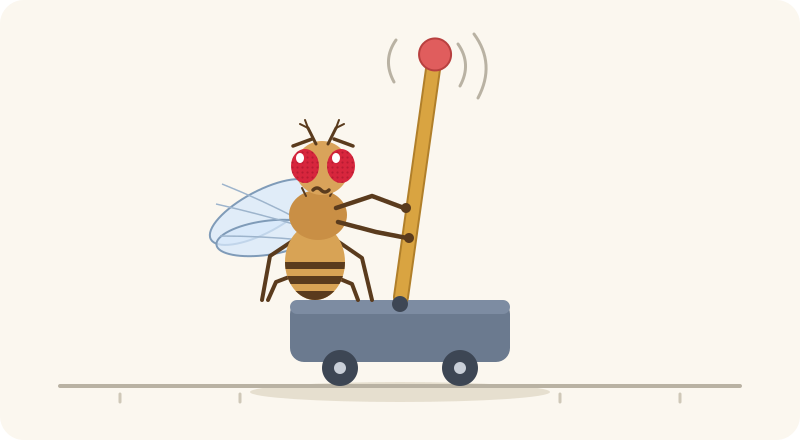
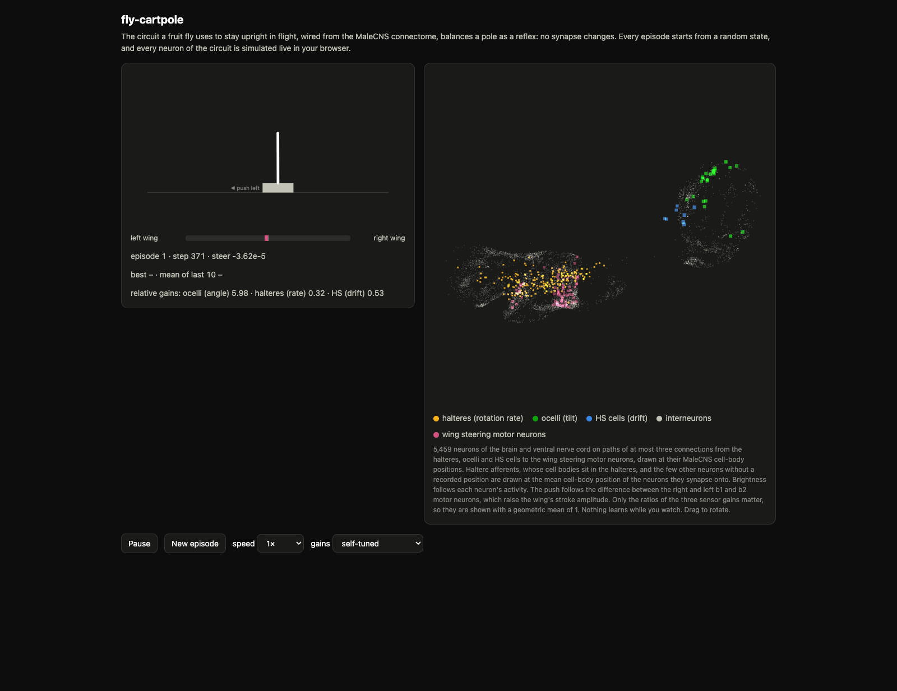
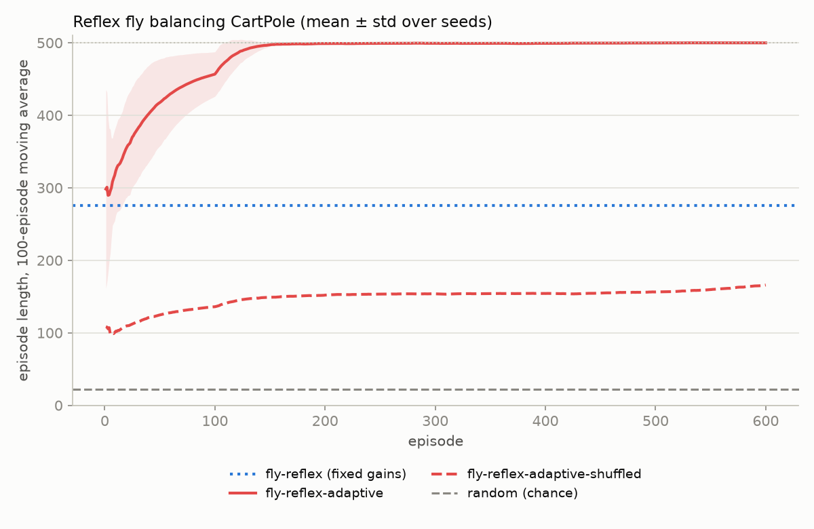
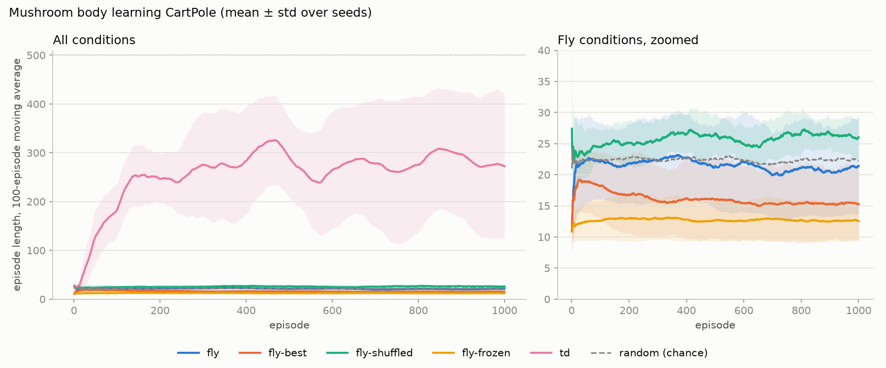

<p align="center">
  
</p>

# fly-cartpole

**English** · [한국어](README.ko.md)

Two circuits of the fruit fly brain, wired synapse by synapse from the
[MaleCNS v1.0](https://male-cns.janelia.org/) connectome, balance Gymnasium's CartPole. The
circuit a fly uses to stay upright in flight does it as a reflex: no synapse changes, and once
the fly has tuned how strongly it listens to each of its senses, it holds the pole for the full
500 steps in 99.85% of its final episodes. The two mushroom bodies, the fly's learning centre,
learn the task with dopamine-gated plasticity and reach 392.5 steps on average. A web viewer runs
the reflex fly live in the browser and shows its flight circuit at work.



## Reflex fly

### Result

**The circuit a fly uses to stay upright in flight, wired as measured, balances the pole as a
reflex, and once the fly has tuned its own sensor gains it holds the pole for the full 500
steps.** With every sensor gain fixed at 1 it lasts 275.6 steps on average. It does not drop the
pole: in the first episode of each evaluation seed, 14 of 20 episodes ended with the cart leaving
the track and the other 6 reached the cap. Letting the fly tune how strongly it listens to each of
its three senses raises the score to **499.9** on 20 evaluation seeds that no earlier run
touched: 99.85% of its final 100 episodes reach the 500-step cap, and the shortest lasts 401 steps.
No synapse changes.



| condition | what it is | final-100 mean ± std (20 seeds) | episodes reaching 500 |
|---|---|---|---|
| `fly-reflex` | the flight circuit as wired, every sensor gain 1 | 275.6 ± 9.4 | 17% |
| `fly-reflex-adaptive` | the same circuit; the fly tunes its three sensor gains over 600 episodes | **499.9 ± 0.3** | 99.85% |
| `fly-reflex-adaptive-shuffled` | the same self-tuning on a degree-preserving shuffle of the circuit | 165.9 ± 182.8 | 20% |
| `random` | uniform random pushes (chance) | 22.1 ± 0.8 | 0% |

Permutation tests on the per-seed final-100 means
([results/reflex/summary.md](results/reflex/summary.md)): the reflex beats chance, self-tuning
helps, and the measured wiring contributes (p = 0.0001 each). The self-tuning rates were chosen on
tuning seeds 100-109 ([results/reflex/tuning.json](results/reflex/tuning.json)); all six
configurations scored between 479 and 500 there, so the result does not hinge on them. The
evaluation used seeds 160-179.

**What the measured wiring gets right is the sign.** Each shuffled circuit can be sorted by
whether its ocellar (angle) and haltere (rate) pathways still reach the wing steering motor
neurons with the sign that rights the body:

| angle pathway | rate pathway | shuffled circuits | final-100 means after self-tuning |
|---|---|---|---|
| corrective | corrective | 4 | 499-500 |
| reversed | corrective | 5 | 176-196 |
| corrective | reversed | 4 | 19-214 |
| reversed | reversed | 7 | 9 (41 once) |

The measured circuit is of the first kind. Self-tuning can scale a pathway but never flip it, so a
shuffle that keeps both signs does as well as the real circuit, and one that reverses both pushes
the pole over in 9 steps.

### How it works

**Connectome slice.** `fly-cartpole extract-flight` keeps every neuron on a path of at most three
connections, each of at least five synapses, from the fly's flight-stabilisation sensors to its
wing steering motor neurons: 203 haltere afferents (the halteres are the fly's gyroscopes), 22
ocellar neurons (the ocelli read the horizon), 8 HS cells (wide-field horizontal motion), 5,159
interneurons in the brain and ventral nerve cord, and 67 wing steering motor neurons; 191,953
connections in all. Each neuron's sign comes from its predicted transmitter (acetylcholine
excites; GABA, glutamate and histamine inhibit), and each connection's weight is its synapse count
divided by the postsynaptic neuron's total annotated input, so every neuron keeps the share of
input the circuit gives it in the whole nervous system. The slice is committed as
`data/flight.npz`.

**Senses.** The pole's angle is read as the fly's body roll: the ocelli on the side that tips up
see more sky. Its angular velocity is read by the halteres: the haltere on the side moving down is
excited. The cart's velocity is horizontal optic flow on the HS cells. Each sense is scaled by its
working range (0.21 rad, 3.5 rad/s, 3 m/s), clipped to ±1 and multiplied by its gain.

**Circuit.** Leaky linear rate units, whose activity is the deviation from tonic firing (so
inhibition is negative activity), run four substeps per CartPole step with leak 0.5 and start from
rest each episode.

**Steering.** The b1 and b2 motor neurons raise the wing's stroke amplitude. A body rolling right
is righted by the right wing beating harder, matched here to pushing the cart right: the fly pushes
right when b1 and b2 are more active on the right than on the left.

**Self-tuning.** Each episode the fly tries slightly different gains, `log g = mu + eps` with
`eps ~ N(0, 0.3²)`. After the episode, dopamine is the episode's length against the fly's recent
record, `(length − mean of its last 20) / mean of its last 20`, and the gains move toward trials
that beat it: `mu += 0.3 · dopamine · eps / 0.3`. Only how strongly each sense drives its sensory
neurons changes.

**What tuning changes.** The circuit is linear and the fly reads only the sign of its steering
signal, so scaling all three gains alike changes nothing; only their ratios matter, and the
viewer shows them with a geometric mean of 1. As wired, a pole falling right moves the steering
signal about 48 times as much through the halteres as a pole leaning right does through the
ocelli, and the HS cells barely reach the steering motor neurons (1/24 of the ocelli). Such a
rate-dominated reflex stops the pole from falling but barely corrects a lean, so the cart drifts
off the track. On seed 0 the fly settled on relative gains of 5.98 (ocelli), 0.32 (halteres) and 0.53 (HS):
it now listens to its ocelli about 19 times as strongly as to its halteres, which cuts the
halteres' lead over the ocelli in the steering signal from about 48 times to about 2.6 times.

### Measured versus invented

- **Measured:** every connection on the paths above and its synapse count; each neuron's predicted
  transmitter; which neurons are haltere afferents, ocellar neurons, HS cells and wing steering
  motor neurons; cell-body positions.
- **Invented or assumed:** the mapping from CartPole to flight (pole angle as body roll, angular
  velocity as haltere rotation, cart velocity as optic flow); the haltere's sign, the one sign not
  read from the connectome (it matches the corrective haltere-to-b1 reflex; Dickinson 1999);
  steering by b1 and b2 and its match to a push; the working ranges used for scaling; linear rate
  units and their time constants; transmitter signs (glutamate and histamine are treated as
  inhibitory everywhere); the self-tuning rule and its rates in
  [results/reflex/hyperparameters.json](results/reflex/hyperparameters.json).

### Where it falls short

- The fly has no sense of where the cart is, so nothing pulls the cart back to the centre. The
  self-tuned fly stays on the track for 500 steps, but nothing here shows that it holds its place
  beyond the cap.
- The connectome records chemical synapses only, while in the blowfly the haltere afferents reach
  the b1 motor neuron through electrical synapses as well (Fayyazuddin and Dickinson 1996).
- The shuffle moves connections together with their weights, so a shuffled neuron can receive up
  to 5.7 times the input scale of any real neuron (0.98). Its dynamics stay stable, but "wiring
  contributes" compares topology and input scale together. The self-tuning rates were chosen on
  the real circuit and reused for the shuffle.
- One linear rate model; no spikes, no neuromodulation of the flight circuit, no head or neck
  movements.
- The probes that set the haltere sign and the sensor scaling ran on seeds 100-159 and 500-519;
  tuning used seeds 100-109 and evaluation seeds 160-179.

## Mushroom body fly

The first fly in this repository learns. Its two mushroom bodies, the fly's learning centre,
learn to balance the pole with dopamine-gated plasticity. Its live viewer was replaced by the
reflex fly's and remains in the git history at commit `bd43325`.

### Result

**The fly learns to balance the pole, and runs the full 500 steps in almost half of its final
episodes.** With its innate wiring it drops the pole after about 19 steps
(`fly-bilateral-frozen`). After 3,000 episodes it holds the pole for **392.5 steps** on average
over the last 100 episodes, across 20 evaluation seeds that no earlier experiment touched, and
46% of those episodes reach the 500-step cap. 19 of the 20 flies clear CartPole-v0's "solved"
mark of 195 on their own, and 6 clear CartPole-v1's 475. A textbook TD actor-critic reading the
same Kenyon cells, under the same reward, balances perfectly on every seed (500). The Kenyon
cell code and the reward are enough; what holds the fly back is its learning rule.



| condition | what it is | final-100 mean ± std (20 seeds) | episodes reaching 500 |
|---|---|---|---|
| `fly-bilateral` | two mushroom bodies, prediction error dopamine, push-pull plasticity | **392.5 ± 103.1** | 46% |
| `fly-bilateral-shuffled` | same, with PN→KC and KC→MBON wiring shuffled (degree-preserving) | 390.3 ± 96.4 | 44% |
| `fly-bilateral-frozen` | same, without plasticity | 18.7 ± 9.9 | 0% |
| `fly` | the first design: one mushroom body, actions smelled as odours | 20.7 ± 3.6 | 0% |
| `td` | TD actor-critic on the same Kenyon cell code (not a fly) | 500.0 ± 0.0 | 100% |
| `random` | uniform random pushes (chance) | 22.8 ± 0.9 | 0% |

Permutation tests on the per-seed final-100 means (every condition and test is in
[results/summary.md](results/summary.md)):

- the fly learns: `fly-bilateral` > `fly-bilateral-frozen`, p = 0.0001;
- it beats chance: `fly-bilateral` > `random`, p = 0.0001;
- there is no evidence that the measured wiring helps: `fly-bilateral` >
  `fly-bilateral-shuffled`, p = 0.48. The shuffle keeps the cell counts, how many partners
  each cell has, and where each dopamine neuron lands; it only changes which Kenyon cell talks
  to which. The learning comes from that layout, not from the exact synapse map. Earlier
  evaluations pointed both ways (real wiring ahead on seeds 0-9, p = 0.037; shuffled ahead on
  seeds 30-49).

Hyperparameters were searched on tuning seeds 100-139 only and applied unchanged to the
evaluation seeds 70-89 ([results/tuning.json](results/tuning.json)).

### How we got there

The first design followed [fly-blackjack](https://github.com/WilliamJones/fly-blackjack)
closely and stayed at chance. Each row below is one hypothesis, tested on tuning seeds
(100 and up) before anything touched evaluation seeds. The score is the mean length of the
final 100 episodes, over five tuning seeds unless the row says otherwise.

| # | hypothesis | what changed | tuning seeds | verdict |
|---|---|---|---|---|
| 0 | The fly-blackjack recipe transfers | One mushroom body; the fly smells "state + push left" and "state + push right" and picks the better one (T-maze); dopamine only depresses synapses; punishment when the pole falls, reward while beating the recent mean | 27 | chance |
| 1 | Dopamine should be a prediction error | Dopamine = TD error computed from the fly's own MBON valence (Bennett et al. 2021) | 29 | rejected |
| – | *Diagnostic: is the encoding the problem?* | Unconstrained linear SARSA on the same state + action Kenyon cell code | 34-55 | yes: the action-as-odour code hides the state |
| 2 | One mushroom body per push direction | The left mushroom body values pushing left, the right one pushing right; both see only the state | up to 67 | first signal, unstable |
| 3 | An innate left/right bias blocks learning | Centre each side on its innate average value | 61 | rejected |
| 4 | Naive flies are indifferent | Value = learned change only | 63 | rejected |
| 5 | The unchosen side should learn the opposite lesson | Opponent teaching between the two sides | 39 | rejected |
| 6 | The targets exceed what bounded synapses can express | Fall-only punishment, scaled down | 49 | rejected |
| – | *Diagnostic: is the synapse rule the problem?* | Unconstrained linear SARSA on the two state-only codes | 275 | yes: bounded, depression-only synapses |
| 7 | The MBON readout is too weak | Amplify the MBON-to-choice readout | 62 | rejected |
| 8a | Dopamine cross-talk cancels learning | Punishment only on approach MBONs, reward only on avoidance MBONs | 49 | rejected |
| **8b** | **Depression-only plasticity exhausts synapses** | **Push-pull: traced synapses weaken where the released dopamine lands and recover where the opposing dopamine lands** | **237** | **learns** (evaluation seeds 0-9: 194) |
| 9 | Better generalisation across states | Wider glomerulus tuning, more active Kenyon cells | 234 | no gain |
| 10 | The reward schedule is off | Smaller record reward, shorter discount, or punishment at falls only | 235 at best; fall-only 91-187 | no gain |
| 11 | An innate bias still hurts under push-pull | Centre each side again | 174 | rejected |
| 12 | It just needs more practice | 2,000 episodes | 147, 237, 167, 182 at 500, 1,000, 1,500, 2,000 | no: performance drifts |
| 13 | Sleep consolidates | Replay each episode once more after it ends | 176 | rejected |
| 14 | Plasticity should settle with experience | Learning rate falls as lr / (1 + episode / τ) | 178 | rejected |
| – | *Diagnostic: do the synapses saturate?* | Track gains and values during training | 2-7% of gains at a bound; one side can express values from about −0.6 to +0.7, while the targets run from −1 (a fall) to +10 (a long record run) | the targets, not the synapses, are out of range |
| 15 | Outcomes must fit the value range | Scale punishment and record reward by 0.1, with a larger learning rate | 275 | looked better, but scored 115 on evaluation seeds 0-9: three of ten flies never learned |
| – | *Diagnostic: why do some flies never learn?* | Follow both sides' values in a stuck fly | One side's value sank below the scaled punishment (−0.1). The other side's value cannot fall below that, so it wins every choice, and the sunken side is never tried again | a lock-in; 8 of 40 fresh tuning seeds lock in at scale 0.1, 1 at 0.3, 2 at 1.0 |
| 16 | The record reward's moving target causes the collapses | Slower baseline (50 or 100 episodes), or a fixed reward for every step survived | 215 at best | rejected: the record reward over the last 20 episodes works best |
| 17 | A softer choice lets the sunken side back in | β = 30 instead of 100 at scale 0.1 | 44 (40 seeds, 300 episodes), 6 locked in | rejected |
| **18** | **Five tuning seeds are too few to see a one-in-five failure** | **Tune on 40 seeds (100-139) over outcome scales 0.1, 0.3 and 1.0, with the record reward fixed at 0.1** | **221 (40 seeds), no seed locked in** | **adopted: outcome scale 0.3; 191.7 after 1,000 episodes on fresh evaluation seeds 30-49** |
| **19** | **With outcomes in range, more practice keeps helping** | **2,000 episodes instead of 1,000** | **194, 221, 231, 227, 232 at 500, 1,000, 1,250, 1,500, 2,000 (40 seeds)** | **adopted: gains flatten after 1,250 episodes but never collapse; 233.8 on fresh evaluation seeds 50-69** |

Three findings carried the result. First, the fly-blackjack choice scheme, where the fly
smells each action as an odour and compares the two, buries the pole's state under the action
code; giving each push direction its own mushroom body fixed that. Second, synapses that
dopamine can only weaken run out: every mistake is punished by depression, the useful synapses
sink to zero and never come back. Letting the opposing dopamine population restore traced
synapses (push-pull) turned a stuck fly into one that balances the pole for hundreds of steps.
Third, the values one mushroom body can express through bounded synapses span only about −0.6
to +0.7, while a fall is worth −1 and a long record run up to +10. Shrinking the outcomes toward
that range (to 0.3 of their size) made learning faster and more even across seeds; shrinking
them too far (0.1) let one side sink below the punishment and lock the fly into pushing one way.

The reward schedule came from a human analogy: punishment when the pole falls, and a reward
on every step once the fly beats its recent record, like a person whose best is 5 seconds
feeling a rush at second 6. Without that record reward the fly still learned with a short
discount (187 at γ = 0.95), but at the tuned discount (γ = 0.99) it collapsed on three of
five tuning seeds (91). A record that moves more slowly, or a fixed reward for every step
survived, also did worse (hypothesis 16).

#### Aiming for 500

Once the fly passed 195, the goal was raised to the 500-step cap. A diagnostic showed where the
trained fly failed: 58% of its episodes ended with the cart leaving the track rather than the
pole falling, and a fly that always picked its better side did no better than one choosing
stochastically. The rows below ran on ten tuning seeds for 3,000 episodes unless noted.
Hypotheses 24, 30-31 and 32-33 were the project author's ideas, as was the record reward.

| # | hypothesis | what changed | tuning seeds | verdict |
|---|---|---|---|---|
| 20-21 | The fly cannot see the track edge coming | Discount 0.998 instead of 0.99, outcomes scaled to 0.1, learning rate 0.05 | 332 | adopted |
| – | *Diagnostic: does the record reward push the cart off centre?* | Punishment at falls only | 40 | no: the record reward is essential |
| 22 | Velocity glomeruli are too coarse | Tile only the velocities the fly actually meets | 298-315 | rejected |
| **24** | **Reward posture, not only survival** | **Potential-based shaping: reward for moving toward upright and centred, punishment for moving away** | **388** | **adopted** |
| 25 | A stronger posture signal | Larger shaping, or three times the weight on position | track exits fall to 11-12%, but flies lock in again (174-284) | rejected |
| 26 | Active forgetting prevents lock-in | Gains drift back toward 0.5 between episodes | 91-199 | rejected |
| 27 | Teach against the state's expected value, or rebalance the posture signal | Actor-critic style prediction; more weight on position within the same budget | 329-376 | no gain |
| 28 | Noisy choices random-walk the cart off the track | β = 300 or 1,000 instead of 100 | 366-386 | no gain alone |
| **29** | **A fly that balances well should stop unlearning** | **Learning rate 0.05 / (1 + episode / 1,000), β = 300** | **416** | **adopted** |
| 30-31 | Credit should reach further back | Eligibility traces lasting 0.27 to 1.4 s instead of 0.06 s | 170-339; track exits fall to 15% but learning slows | rejected |
| – | *Diagnostic: does the fly explore?* | Chance of picking the lower-valued side | picked on 4-5% of steps, but on half of all steps its chance is below 0.1% | it explores only where it is unsure |
| **32-33** | **Explore everywhere, not only where unsure** | **1-3% of choices ignore the values (spontaneous behaviour)** | **446 at 1%, 440 at 2%, 399 at 3%; 4,000 episodes slipped to 418** | **adopted, with 3,000 episodes** |
| **34** | **Confirm on forty seeds** | Spontaneous rate 1% or 2% on tuning seeds 100-139 | 407 at 2%, no fly locked in | 392.5 on fresh evaluation seeds 70-89 |

Three more findings took the fly from 234 to 393. The posture reward tells the fly at once
when a push tilts the pole or carries the cart away from the centre, instead of only when the
episode ends hundreds of steps later. Settling plasticity keeps a fly that has learned to
balance from unlearning it. And exploration: the fly explored only where its two values were
close, so in half of all states it never tried the other side, and a confident but wrong value
was never corrected. Making 2% of choices spontaneous let those values be corrected, cut track
exits from 44% to 28%, and lifted the tuning score from 416 to 440.

**Evaluation seeds were spent five times, and every spend is reported here.** Seeds 0-9
evaluated the push-pull fly at outcome scale 1.0 (194) and then at 0.1 (115, the lock-in).
Seeds 10-29 evaluated a run in which the original fly's search had also chosen the size of the
record reward for every other condition (0.5 instead of 0.1; bilateral fly 162.5); the reward
is part of the task, so it is now fixed and never searched. Seeds 30-49 evaluated the
forty-seed tuned fly after 1,000 episodes (191.7), and seeds 50-69 the fly after 2,000 episodes
(233.8), which met the first goal of 195. The numbers at the top come from seeds 70-89, which no
earlier experiment touched.

### How it works

**Connectome slice.** `fly-cartpole extract` downloads the official MaleCNS v1.0 flat
connectome and keeps both mushroom bodies. Right: 343 antennal lobe projection neurons (PN),
1,912 Kenyon cells (KC) with both PN input and MBON output, 49 mushroom body output neurons
(MBON), and the 332 PAM and PPL1 dopaminergic neurons (DAN) that synapse onto those MBONs.
Left: 343 PNs, 1,893 KCs and 48 MBONs. Every edge keeps its synapse count, and each cell's
inputs are normalised to sum to one. A KC receives 5.8 PNs on average, matching the
literature. The slices are committed as `data/mb_right.npz` and `data/mb_left.npz`.

**Two sides, two actions.** The left mushroom body values pushing left, the right one
pushing right. Both hear the same state, and neither is told which action it stands for.

**Encoder.** The glomeruli (PN groups) tile the four CartPole state variables with Gaussian
tuning curves; sister PNs of a glomerulus fire together.

**Kenyon cells.** PN activity times the measured PN→KC matrix; the top 5% of KCs fire
(k-winners-take-all standing in for the APL neuron).

**Value and choice.** An MBON counts as approach if PPL1 (punishment) dopamine dominates its
dopaminergic input and as avoidance if PAM (reward) dopamine does (Aso et al. 2014). Each
side's value is its approach MBON output minus its avoidance MBON output, and the fly picks
a side with `sigmoid(beta * (left - right))`. 2% of choices ignore the values altogether
(spontaneous behaviour, as flies show; Maye et al. 2007), so a side the fly has written off
still gets retried.

**Reward.** PPL1 punishment when the pole falls; a small PAM reward on every step once the
episode is longer than the mean of the last 20 episodes; and a posture signal on every step,
`3 * (0.998 * phi(next) - phi(now))` with `phi = -(angle / 12°)² - (position / 2.4 m)²`.
Moving toward upright and centred is rewarded and moving away is punished (potential-based
shaping; Ng, Harada and Russell 1999). The reward is part of the task: every condition,
including the TD reference, gets the same one.

**Dopamine as a prediction error.** Dopamine carries the surprise rather than the raw reward:
`delta = scale * (reward - punishment) + gamma * expected next value - current value`. PAM
fires for `max(delta, 0)` and PPL1 for `max(-delta, 0)`, with `gamma = 0.998`. The outcome
scale (0.1) keeps the values the fly must learn inside the range its bounded synapses can
express. Where each dopamine population lands is read from the measured DAN→MBON wiring.

**Push-pull plasticity.** KC→MBON synapses have gains between 0 and 1, starting at 0.5. A
decaying trace remembers which KCs of the chosen side were active. Released dopamine
depresses traced synapses in the compartments it reaches (Hige et al. 2015; Handler et al.
2019), and the opposing dopamine population restores traced synapses in its own
compartments. The learning rate settles with experience, as `0.05 / (1 + episode / 1000)`.

### Measured versus invented

- **Measured:** every PN→KC, KC→MBON, DAN→MBON and MBON→DAN connection and its synapse
  count; which dopamine population dominates each MBON; cell-body positions.
- **Invented:** the glomerulus encoder; k-winners-take-all instead of the APL neuron; rate
  units; one mushroom body per push direction; dopamine as an idealised prediction error;
  recovery of synapses under the opposing dopamine; bounded gains starting at 0.5; settling
  plasticity; spontaneous choices; the reward schedule, its posture signal and its scale; and
  the hyperparameters in
  [results/hyperparameters.json](results/hyperparameters.json).

### Limitations

- Only the mushroom bodies are simulated; nothing else in the brain is computed or drawn.
- Rate units, no spikes, no APL, KC→KC or MBON→MBON connections.
- The fly balances well but not perfectly: it averages 393 steps, individual flies range from
  162 to 500, and a TD learner on the same code and reward is perfect.
- The posture signal tells the fly more than whether the pole fell. The fly without it
  (233.8 on seeds 50-69, after 2,000 episodes) is the cleaner test of learning from sparse
  outcomes.
- The outcome scale, the posture signal, exploration and the training length were chosen after
  earlier evaluations had fallen short; each choice was tested on tuning seeds first and then
  evaluated on unused seeds, but the sequence of choices was guided by what those shortfalls
  revealed.
- MBON valence labels follow the compartmental account and were not checked against
  individually characterised MBONs.
- One dataset and twenty evaluation seeds. Each seed also draws its own glomerulus-to-variable
  assignment, shared by every condition of that seed, so the spread across seeds mixes that
  assignment with learning noise.

## Viewer

```bash
python3 -m http.server -d web   # then open http://localhost:8000
```

The viewer runs the reflex fly live: every neuron of the flight circuit is simulated in the
browser from the exported couplings, and a test checks its steering against the Python model to
1e-9. Every episode starts from a random state. Choose "fixed (wiring only)" to watch the circuit
as wired, or "self-tuned" for the gains the fly tuned for itself over 600 episodes on seed 0, the
default rather than a seed picked for looks (its final 100 episodes averaged 500 steps).
Left: the cart, the steering signal (b1 and b2 activity on the right against the left) and the
relative gains. Right: the circuit's 5,459 neurons in the brain and ventral nerve cord at their
MaleCNS cell-body positions: halteres (amber), ocelli (green), HS cells (blue), interneurons
(grey) and wing steering motor neurons (magenta), each brightening with its activity. Haltere
afferents have their cell bodies in the halteres, outside the nervous system, so they and the few
other neurons without a recorded position are drawn at the mean cell-body position of the neurons
they synapse onto.

## Run it

```bash
uv sync
uv run fly-cartpole extract-flight   # downloads MaleCNS once; data/flight.npz is already committed
uv run fly-cartpole reflex-tune      # self-tuning rates on tuning seeds 100-109
uv run fly-cartpole reflex-compare   # reflex conditions on seeds 160-179, writes results/reflex/
uv run fly-cartpole export-flight    # tunes the fly on seed 0 and writes web/data/flight.json
uv run fly-cartpole extract          # the mushroom bodies; data/mb_*.npz are already committed
uv run fly-cartpole tune             # mushroom body search on tuning seeds 100-139
uv run fly-cartpole compare          # mushroom body conditions on seeds 70-89, writes results/
uv run pytest
```

On 12 CPU cores `reflex-tune` and `reflex-compare` take about 1.5 hours each, `tune` about
2 hours 40 minutes and `compare` about 1 hour 35 minutes.

## Credits

- MaleCNS v1.0 connectome, CC BY 4.0; see [NOTICE.md](NOTICE.md).
- Method adapted from [fly-blackjack](https://github.com/WilliamJones/fly-blackjack) (MIT).
- Aso et al. 2014, *eLife* (MBON valence); Hige et al. 2015, *Neuron* (KC→MBON
  depression); Handler et al. 2019, *Cell* (timing of dopamine plasticity); Bennett et al.
  2021, *Nature Communications* (prediction errors in the mushroom body); Barto, Sutton and
  Anderson 1983 (cart-pole and the actor-critic); Ng, Harada and Russell 1999, *ICML*
  (potential-based reward shaping); Maye et al. 2007, *PLoS ONE* (spontaneous behaviour in
  flies).
- Dickinson 1999, *Philosophical Transactions of the Royal Society B* (haltere-mediated
  equilibrium reflexes); Fayyazuddin and Dickinson 1996, *Journal of Neuroscience* (haltere input
  to the b1 steering motor neuron).
